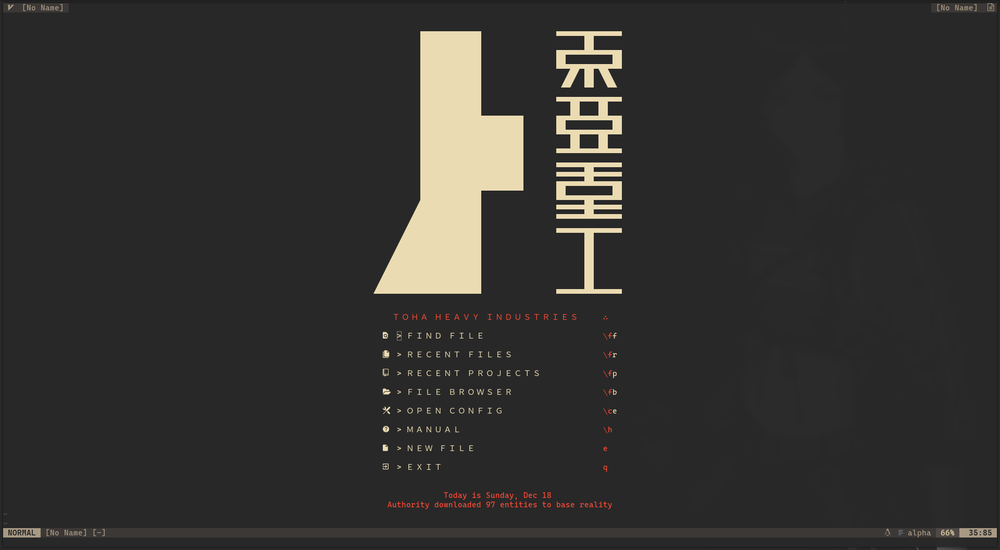
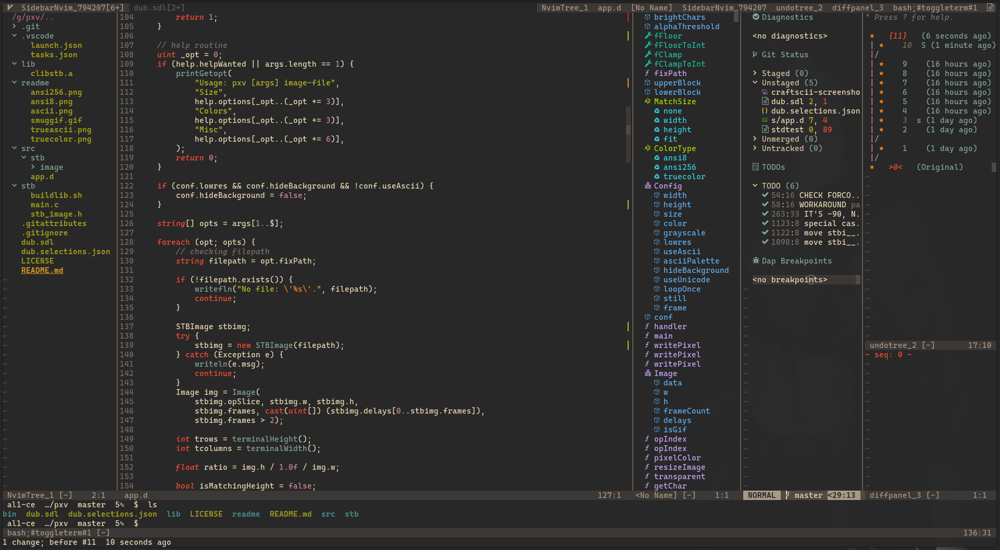
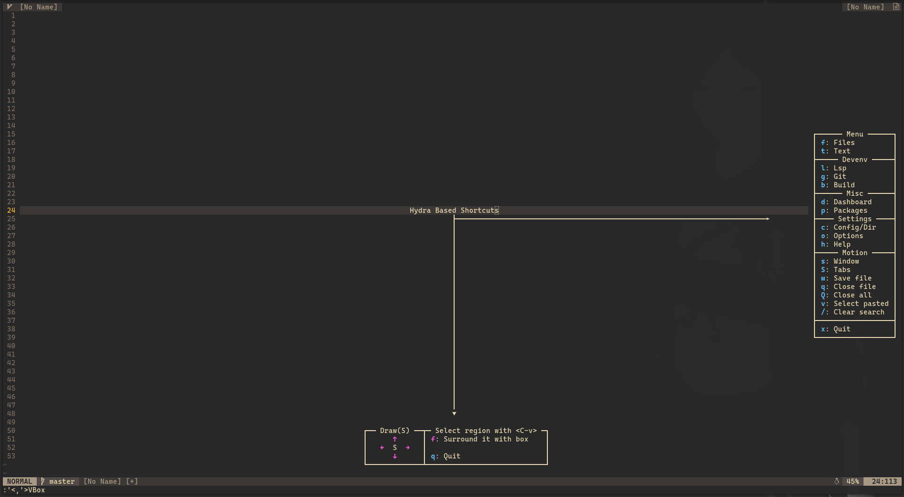

# MonolithVim

#### This distro is not supposed or intended to be perfect out of the box experience. It is preconfigured to be vanilla-like friendly experience, but for your personal needs changing configs will be required.
#### If this doesn't suit you then please look at [other NeoVim distributions](#other-neovim-distributions)

> And 1984 would not be like 1984

<!--toc:start-->
  - [Preview](#preview)
  - [Features](#features)
  - [Requirements](#requirements)
  - [Installation](#installation)
  - [Other NeoVim distributions](#other-neovim-distributions)
<!--toc:end-->

## Preview
#### Custom stylish industrial dashboard

#### Easy to setup coding experience

#### Lsp and debug tools included

#### Almost vanilla key mappings with '\\' as your power key for summoning the Hydra

## Features
- File explorer with Nvim-tree
- Autocompletion with Cmp
- Git integration with Gitsigns
- Status line with Lualine
- Terminal with Toggleterm
- Many tools with Telescope
- Syntax highlight with Treesitter
- Formatting with Null-ls
- Language Server Protocol with Native LSP
- Debug Adapter Protocol with nvim-dap
- Powerful shortcut engine with Hydra
- Build system with Just ([just.nvim](https://github.com/al1-ce/just.nvim))
- Preconfigured for D 

And much more. For sources and other plugins with descriptions see "plugins" directory.

## Requirements (not full list, see issue #17)
- Nerd Fonts
- Neovim 0.8
- Terminal with truecolor support (preferably)
- Node
- Python
- Rigrep
- Yarn
- Dfmt (for D formatting)
- Just (for building projects)

## Installation
```bash
git clone https://github.com/al1-ce/MonolithVim ~/.config/nvim
nvim +PackerSync
```

## Other NeoVim distributions
- [AstroNvim](https://github.com/AstroNvim/AstroNvim)
- [CosmicNvim](https://github.com/CosmicNvim/CosmicNvim)
- [LunarVim](https://github.com/LunarVim/LunarVim)
- [NvChad](https://github.com/NvChad/NvChad)
